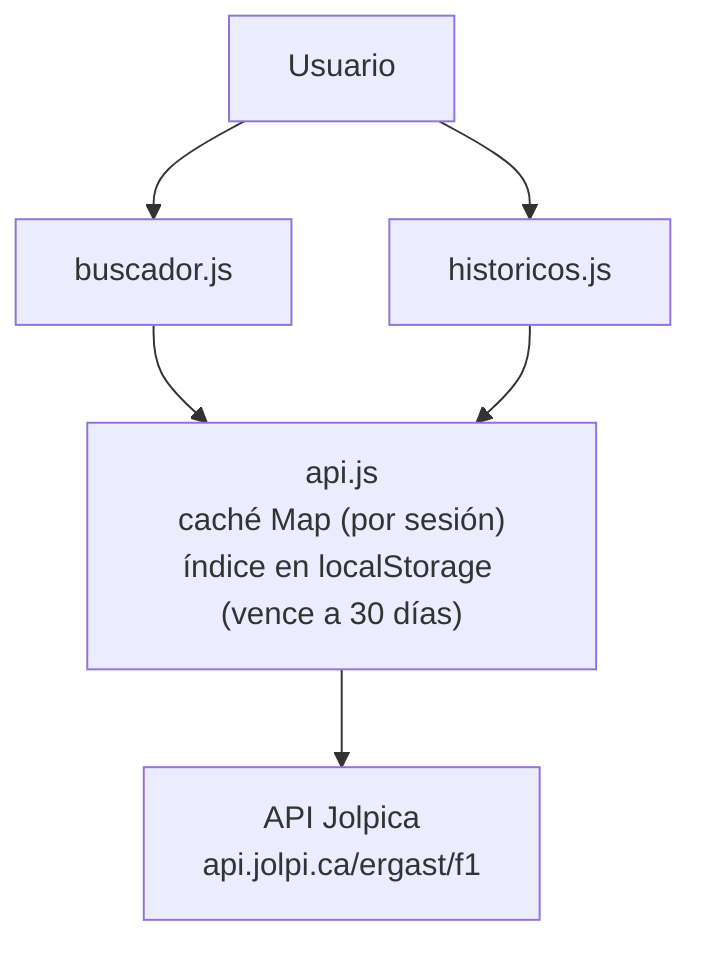

# F1 FanZone

Sitio fan de Fórmula 1 con landing informativa y explorador histórico conectado a la API Jolpica (datos 1950-2026).

**🔗 Sitio en vivo: [migueltapiaurrutia.github.io/f1-fanzone](https://migueltapiaurrutia.github.io/f1-fanzone/)**
**🔍 Explorador histórico: [migueltapiaurrutia.github.io/f1-fanzone/buscador.html](https://migueltapiaurrutia.github.io/f1-fanzone/buscador.html)**

## Secciones

- **Hero** — Presentación con CTA hacia el campeonato.
- **Campeonato** — Tablas de pilotos y constructores tras el GP de Mónaco 2026.
- **Calendario** — Tarjetas de las próximas seis carreras, con badges de próxima cita y formato Sprint.
- **Escuderías** — Los 11 equipos de la parrilla 2026 con alineaciones, motor y color identificativo.
- **Historia** — Línea de tiempo con cinco hitos, de Silverstone 1950 a la nueva era 2026.
- **Buscador** — Explorador histórico de pilotos, escuderías y temporadas (fase 2).

## Funcionalidades de la fase 2

- **Búsqueda cruzada piloto ↔ escuderías**: desde la ficha de un piloto se navega a cualquiera de sus equipos, y de un equipo a cualquiera de sus pilotos históricos.
- **Búsqueda tolerante con selección de candidatos**: acepta nombres parciales, con tildes o completos; "schumacher" ofrece elegir entre Michael, Ralf y Mick.
- **Históricos por temporada**: clasificación completa del campeonato de pilotos de cualquier año entre 1950 y 2026, con el campeón destacado.
- **Tres estados de UI siempre visibles**: cargando, sin resultados con sugerencias clickeables, y error con botón de reintento (`aria-live` para lectores de pantalla).

## Arquitectura de la fase 2



- La **caché `Map`** vive en memoria: cada ruta se pide una sola vez por sesión.
- El **índice completo** (879 pilotos, 214 escuderías) vive en `localStorage` con marca de tiempo y se renueva a los 30 días; permite filtrar localmente sin tocar la red.

## Tecnologías

- **HTML5 semántico** — `section`, `article`, `time`, tablas con `caption` y `scope`.
- **CSS3** — Grid, Flexbox, custom properties, `clamp()` para tipografía fluida.
- **JavaScript vanilla** — ES Modules, `fetch`, IntersectionObserver; sin dependencias.

## Decisiones técnicas

### Fase 1

- Mobile-first con Grid `auto-fit` para layouts responsive sin media queries innecesarias.
- Tablas semánticas con `caption` y `scope` para accesibilidad real con lectores de pantalla.
- Menú móvil con patrón estado-como-clase: JS conmuta la clase, CSS anima.
- `aria-expanded`, `focus-visible` y `scroll-padding-top` como base de accesibilidad e interacción.
- Sitio fan sin marcas ni recursos oficiales, por respeto a la propiedad intelectual.

### Fase 2

- **Capa de API que desencapsula MRData**: el resto de la app no conoce el formato del proveedor; cambiar de API costaría un solo archivo.
- **Doble caché** — `Map` por sesión e índice persistente con vencimiento — para respetar el rate limit (~200 req/h) de un servicio comunitario.
- **`Promise.all`** para peticiones independientes en paralelo, en lugar de `await` en serie.
- **`textContent` para datos externos** (prevención de XSS): a diferencia del JSON propio de proyectos anteriores, aquí los datos vienen de un servidor que no controlamos.
- **Mensajes de error que guían en vez de culpar**: sugerencias clickeables y botón de reintento.

## Roadmap

- ✅ **Fase 2 — API de datos históricos**: buscador de pilotos y equipos con cruce de datos, y consulta de históricos por temporada. _Cumplida._

## Mejoras futuras

- Comparador de dos pilotos cara a cara.
- Resultados carrera por carrera de cada temporada.
- Gráficos de evolución de puntos a lo largo del año.

## Ejecutar localmente

```bash
git clone git@github.com:MiguelTapiaUrrutia/f1-fanzone.git && cd f1-fanzone
npx serve .  # servidor local: los ES Modules no cargan desde file://
```

## Créditos

Datos de [Jolpica F1 API](https://github.com/jolpica/jolpica-f1), proyecto open source y comunitario que mantiene vivo el legado de Ergast. Si te resulta útil, [apóyalos en Ko-fi](https://ko-fi.com/jolpicaf1).

## Estado

✅ Fase 1 y 2 completadas

## Aviso

Sitio fan no oficial. Sin afiliación con Formula 1, FIA ni equipos.
